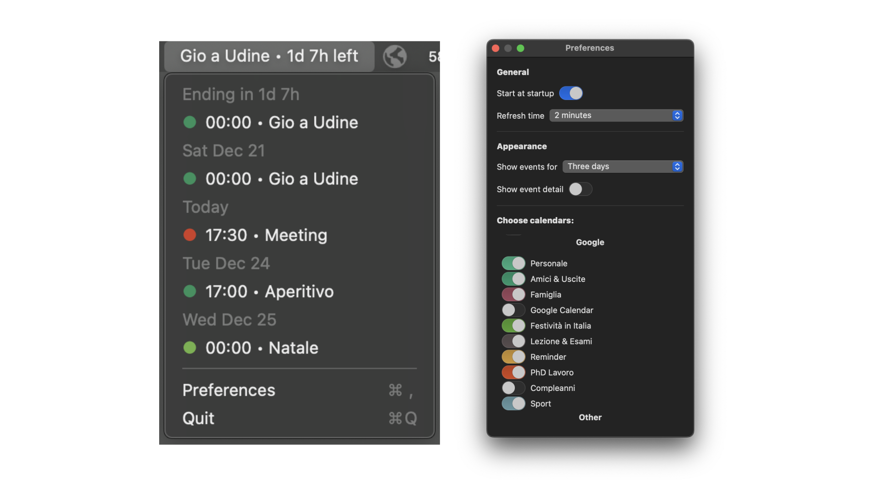

# BusyBee 🐝

BusyBee is a macOS menu bar application that keeps you informed of your upcoming calendar events at a glance. Stay organized with a sleek, user-friendly interface, and never miss a meeting or event again!

(Yes, this README was generated by ChatGPT!)

## Screenshots 📸  



## Installation 🛠️  

1. Clone the repository:  
   ```bash  
   git clone https://github.com/Aleclock/BusyBee.git```  
2. Open the project in Xcode.  
3. Build and run the app to see it in action.

## Feedback and Support 📨  

Feel free to open an issue or reach out via email at [clocchiatti.projects@gmail.com]. 
